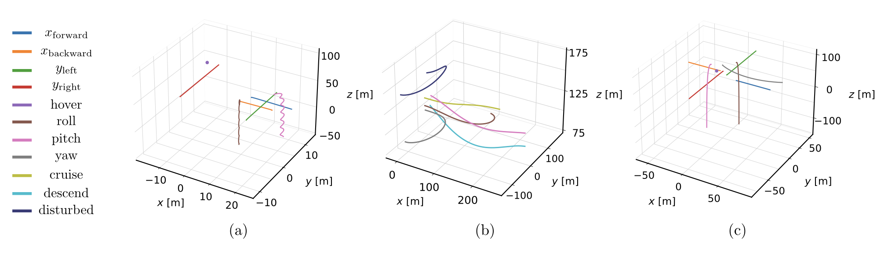

# Object Identification Under Known Dynamics: A PIRNN Approach for UAV Classification

This repository contains the code, data, and methods needed to use a ResNet PINN (PIRNN) to classify UAVs based on their trajectory data. It includes the simulations for UAV trajectories as well as the PIRNN structure.

<!-- *Note: Certain code segments have been omitted due to ongoing manuscript reviews.* -->

---

## Project Structure 
- Fixed_wings / Helicopter / Quadcopter:
    - `FixedWingUAV.py`, `HelicopterUAV.py`, `quadcopter.py` - Modeling and dynamic characteristics of each UAV
    - `FW_ScenarioSampler.py`, `Heli_ScenarioSampler.py`, `Quad_ScenarioSampler.py`: Capture a wide range of flight conditions
    - `FW_traj_generator.py`, `Heli_traj_generator.py`, `Quad_traj_generator.py`: Simulate to generate multiple trajectories under diverse flight conditions.
    - `fw_dataset.npz`, `heli_dataset.npz`, `quad_dataset.npz`: A total of 1000 trajectories were stored for each UAV
- results: Include the pretrained model, recorded loss values, training loss plots, and normalized statistics for each UAV class.
- `Noise.py`: Generate gaussian/ uniform noise
- `PINN.py`: Neural network structure for the ResNet style PINN
- `PINN_Classifier.py`: PIRNN workflow/ pipeline
- `UAVDataset.py`: Create a structured dataset for each UAV type, compatible with neural network training requirements
- `data_distribution.py`: Apply PCA and t-SNE to reduce data to 2D form and visualize class separation
- `run_main.py`: Train the PIRNN, test its classification capability, and produce an evaluation summary
- `load_model.py`: Load the pretrained model and test for unseen trajectories

---

## Requirements
- Python 3.11.12
- matplotlib==3.10.3
- numpy==2.3.1
- pandas==2.3.1
- scikit_learn==1.7.0
- scipy==1.16.0
- torch==2.7.1

Install dependencies using:

```bash
pip install r- requirements.txt
```

---


## How to Run

### Step 1: Setup

Download or clone the repository:

```bash
git clone https://github.com/NyiNyi-14/PINN_based_UAV_Classification.git
```

All scripts must reside in the same directory for proper execution.

### Step 2: Update the Working Directories

Before running the code, set the appropriate input and output paths in the scripts `FW_traj_generator.py`, `Heli_traj_generator.py`, `quadcopter.py`, `load_model.py`, and `run_main.py` to specify where the results should be saved.

### Step 3: Run the code

Run `run_main.py` to train your own PIRNN model with custom hyperparameters.

Run `load_model.py` to load the pretrained PIRNN model and test it on unseen UAV trajectories

---

## Visualizations


<p align="center">
  Figure 1: Learning workflow of the physics-informed residual neural network (PIRNN)
</p>

&nbsp;


<p align="center">
  Figure 2: (a) ResNet style neural network architecture (b) Softmax-weighted multi-class confidence estimation
</p>

&nbsp;

<p align="center">
  
</p>
<p align="center">
  Figure 3: Data distribution of UAVs: PCA (left) and t-SNE (right)
</p>

&nbsp;


<p align="center">
  Figure 4: Examples of UAV trajectories generated by <code>quadcopter.py</code>, <code>FW_traj_generator.py</code>, and <code>Heli_traj_generator.py</code>
</p>

&nbsp;


<p align="center">
  Figure 5: (a) Training Loss vs. Validation Loss of the PIRNN, (b) Learning Rate Scheduling
</p>

---

## Performance Evaluation of the Proposed Algorithm

<p align="center">
  
</p>
<p align="center">
  Figure 5: Classification report on clean data
</p>

---

## Robustness Analysis of the Proposed Algorithm


<p align="center">
  
</p>
<p align="center">
  Figure 6: Generate Gaussian noise
</p>

&nbsp;

<p align="center">
  
</p>
<p align="center">
  Figure 7: Classification report on varying levels of noise
</p>

---


## Related Work
This project builds upon recent advances in Physics-Informed Neural Networks (PINNs) and their application to dynamical systems and UAV modeling. Therefore the following topics are highly related and useful:
- Physics-Informed Neural Networks
- Residual Neural Network Structures
- UAV Modeling and Simulation
- Object Classification/ Supervised Learning

---

## Citation

To acknowledge the use of this work, please cite the following publication:

```bibtex
@misc{aung2025objectidentificationknowndynamics,
  title={Object Identification Under Known Dynamics: A PIRNN Approach for UAV Classification},
  author={Nyi Nyi Aung and Neil Muralles and Adrian Stein},
  year={2025},
  eprint={2509.21405},
  archivePrefix={arXiv},
  primaryClass={cs.LG},
  url={https://arxiv.org/abs/2509.21405},
}
```
---
<!-- 
## Authors

**Nyi Nyi Aung** 

PhD Student, Mechanical and Industrial Engineering - LSU, USA

MSc, Sustainable Transportation and Electrical Power Systems (EMJMD-STEPS) - UniOvi, Spain

BE, Electrical Power - YTU, Myanmar

&nbsp;

**Neil Muralles**

Undergraduate Researcher, Mechanical and Industrial Engineering

Mechanical Engineering Student

Louisiana State University

&nbsp;

**Adrian Stein, PhD**

Assistant Professor

Department of Mechanical and Industrial Engineering

Louisiana State University

--- -->
